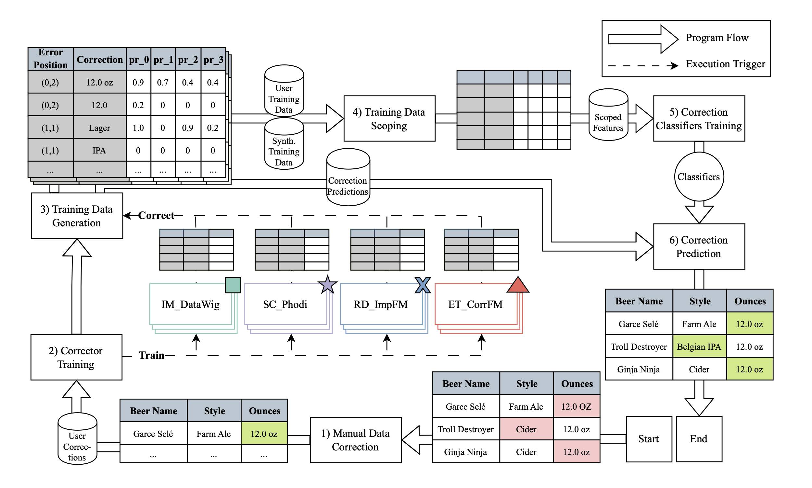

# Mimir: A Holistic Error Correction System
Mimir is a state-of-the-art error correction system.

## Installation
Instructions have been tested on MacOS 14.5 on an Apple M2 Chip.
They should work on UNIX systems and on an amd64 processor architecutre, too.
Running Mimir on Windows is untested.

### Recommended: Local installation via Conda
Mimir can be executed on using `conda` or `mamba`.
To install Mimir on your machine, follow these steps:

1) Install Miniforge3 on you machine.\
Follow the [official installation instructions](https://github.com/conda-forge/miniforge#download).
1) Clone this repository `git clone https://github.com/philipp-jung/mimir.git`.
1) Navigate into the newly cloned directory with `cd mimir`, then, run `conda env create -n mimir -f environment.yml` to create a new conda environment called `mimir`.
1) Run `conda activate mimir` to activate the `mimir` environment.
1) Navigate into the `src/` folder in the `mimir/` directory.
1) Run `python correction.py` to correct sample data errors. Set parameters at the bottom of `correction.py` to adjust the correction process.

### Running Mimir in a container
Mimir can be run as a container as well.

1) Build an image `docker build -t <your_docker_username>/mimir:latest .` Consult the [`docker buildx` documentation](https://docs.docker.com/reference/cli/docker/buildx/) for cross-platform builds.
1) The measurement carried out by the container is controlled by using environment variables. The `CONFIG` environment variable is a serialized hashmap that contains all parameters that Mimir's `Corrector` object is configured with as keys, and an additional parameter called `run`. The `EXPERIMENT_ID` is used to identify experiments, set it to your liking.
1) You can run a container that cleans the `hospital` dataset, using Mimir's full ensemble of correctors by executing `docker run -e CONFIG='{"dataset": "hospital", "n_rows": null, "error_fraction": 1, "error_class": "simple_mcar", "labeling_budget": 20, "synth_tuples": 100, "auto_instance_cache_model": true, "clean_with_user_input": true, "gpdep_threshold": 0.3, "training_time_limit": 600, "llm_name_corrfm": "gpt-3.5-turbo", "feature_generators": ["auto_instance", "fd", "llm_correction", "llm_master"], "classification_model": "ABC", "vicinity_orders": [1], "vicinity_feature_generator": "naive", "n_best_pdeps": 3, "synth_cleaning_threshold": 0.9, "test_synth_data_direction": "user_data", "pdep_features": ["pr"], "fd_feature": "norm_gpdep", "sampling_technique": "greedy", "run": 0}' -e EXPERIMENT_ID=hospital-all-correctors <your_docker_username>/mimir:latest`

## Benchmarks
To run our benchmarking experiments, consider the `README.md` file in the the `benchmarks/` directory.

## Notebook
In the `notebook/` directory, we provide the code used to generate all figures used in the Mimir publication.
