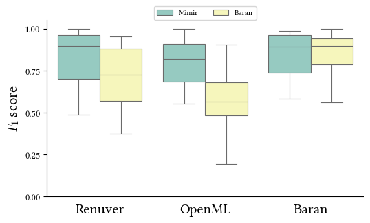
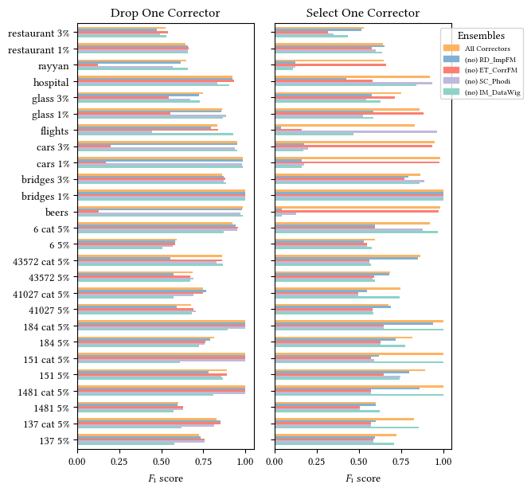
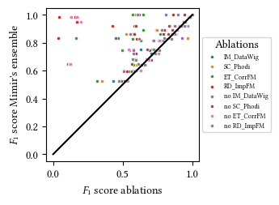

# Mimir: A Holistic Value Imputation System
Mimir is a state-of-the-art error correction system.

## Installation
Mimir can be executed on any platform using `conda` or `mamba`.
To install Mimir on your machine, follow these steps:

1) Install Miniforge3 on you machine.\
Follow the [official installation instructions](https://github.com/conda-forge/miniforge#download).
1) Clone this repository via `git clone <name of the repository>`.
1) In the folder into which you cloned the repository, run `conda env create -n mimir -f environment.yml` to create a new conda environment called `mimir`.

## How to use it
Follow these instructions to clean data with `mimir`:

1) Run `conda activate mimir` to activate the `mimir` environment.
1) Navigate into the `src/` folder in the directory into which you cloned `mimir`.
1) Run `python correction.py` to correct sample data errors. Set parameters at the bottom of `correction.py` to adjust the correction process.

## Experiments
To run our experiments, consider the `README.md` file in the the `infrastructure/` directory.

## Notebook
In the `notebook/` directory, we provide the code used to generate all figures used in the Mimir publication.
Notably, we conduct an extensive ablation study of Mimir's ensemble of correctors, which we present here.

The same shown in the barchart above was used to create the following scatter plot -- scatters above the identity indicate a superior correction quality of Mimir's ensemble of correctors compared to thee respective ablation.

